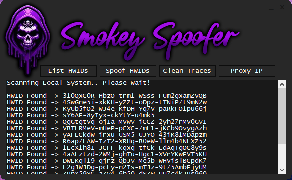
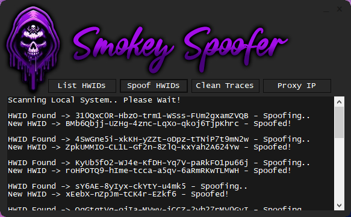

# SmokeySpoofer

SmokeySpoofer is an advanced HWID (Hardware Identification) spoofer designed for Windows 10 and 11. It allows users to change their hardware identification information, providing an effective way to bypass hardware bans in various applications and games.

## Features

- **Advanced HWID Spoofing**: SmokeySpoofer utilizes advanced techniques to spoof a wide range of hardware identifiers including but not limited to CPU, GPU, RAM, Motherboard, and HDD/SSD serial numbers.

- **Windows 10 & 11 Support**: Compatible with both Windows 10 and the latest Windows 11 operating systems.

- **User-Friendly Interface**: Designed with simplicity in mind, SmokeySpoofer offers an intuitive user interface making it easy for users to spoof their HWID with just a few clicks.

- **Bypass Hardware Bans**: With SmokeySpoofer, users can effectively bypass hardware bans imposed by various applications and games, allowing them to regain access and continue enjoying their favorite software.

## Usage

1. **Download**: Clone or download the SmokeySpoofer repository to your local machine.

2. **Run as Administrator**: Right-click on the SmokeySpoofer executable and select "Run as Administrator" to ensure proper permissions.

3. **Select Hardware Components**: Choose the hardware components you wish to spoof from the available options.

4. **Spoof HWID**: Click the "Spoof" button to initiate the spoofing process. SmokeySpoofer will generate a new HWIDs based on the selected components.

5. **Restart**: After spoofing, it is recommended to restart your system to apply the changes effectively.

## Disclaimer

SmokeySpoofer is intended for educational and testing purposes only. The misuse of this software to violate the terms of service of any application or game is strictly prohibited. The developers of SmokeySpoofer are not responsible for any consequences resulting from the use of this software.

## Contributing

Contributions to SmokeySpoofer are welcome! If you have any suggestions, bug reports, or feature requests, feel free to open an issue or submit a pull request.